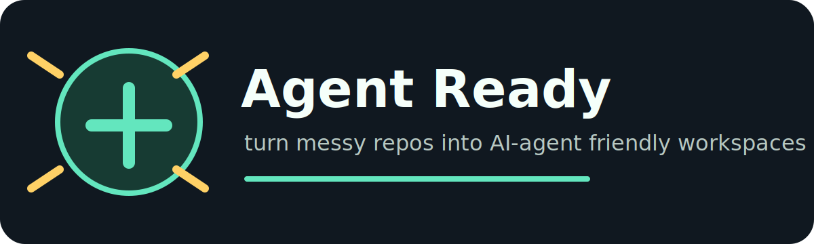

# Agent Ready



Agent Ready scans a repository and generates the context files AI coding agents need before they touch code.

It creates:

- `AGENTS.md`
- `CLAUDE.md`
- `CODEX.md`
- `.agent/context.json`
- `.agent/checklist.md`

## 🔍 Why This Exists

Claude Code, Codex, OpenClaw, Cursor, and other coding agents work better when the repository explains itself. Most repos do not have a clear agent guide, so agents waste time guessing:

- what stack is this?
- how do I run tests?
- where are risky files?
- what should I read before editing?
- what should I avoid changing casually?

Agent Ready turns that repo knowledge into small, reviewable files.

## ⚡ Install

```bash
python3 -m pip install agent-ready
```

For local development:

```bash
python3 -m pip install -e .
```

## 🚀 Quick Start

Preview a repo summary:

```bash
agent-ready . --json
```

Generate agent context files:

```bash
agent-ready . --write
```

Overwrite existing generated files:

```bash
agent-ready . --write --force
```

Check whether generated files are missing or stale in CI:

```bash
agent-ready . --check
```

`--check` exits with status `1` and lists the files to regenerate when repo context changed.

## 🧠 What It Detects

- languages
- frameworks
- package managers
- test commands
- build commands
- lint commands
- GitHub Actions workflows
- important files
- risky areas such as auth, payments, env files, deployments, and migrations
- top-level directories that matter to agents

## 📦 Generated Deliverables

```text
AGENTS.md
CLAUDE.md
CODEX.md
.agent/context.json
.agent/checklist.md
```

`AGENTS.md` gives all agents a shared operating guide.

`CLAUDE.md` focuses on Claude Code behavior and safe verification.

`CODEX.md` focuses on careful coding-agent workflow.

`.agent/context.json` is machine-readable context for future tools and MCP servers.

`.agent/checklist.md` is a lightweight QA checklist before PRs or final answers.

## 🧪 Quality Gate

Before publishing this repo, Agent Ready was checked against these questions:

- Who needs it? Developers using Claude Code, Codex, OpenClaw, Cursor, or local coding agents.
- What pain does it solve? Agents lack repo context and often guess commands, risky files, and workflow.
- Why not just write docs manually? Manual docs are good, but many repos have none. This gives a fast first draft.
- Can a user run it in five minutes? Yes: install, run `agent-ready . --write`, review generated files.
- What can go wrong? Detection is heuristic. Users should review output before committing.

## 🛡️ Security Notes

Agent Ready does not send repository content anywhere. It scans local file names and small config files only.

Recommended use:

- review generated files before committing,
- do not commit real `.env` files,
- treat generated risk areas as prompts for human review, not absolute truth,
- run inside a trusted local checkout.

## 🗺️ Roadmap

- OpenClaw profile
- MCP server from `.agent/context.json`
- VS Code extension
- monorepo service map
- ownership/team map
- config file for custom rules
- GitHub Action that checks whether a repo is agent-ready
- richer CI snippets for `agent-ready . --check`

## 💛 Support

If this helps your agents make fewer mistakes, support is optional and appreciated:

- EVM: `0x1ecab01075f3bdf1b56b7d849c8e28ef88943624`
- PayPal: `ckelvinkhanh32@gmail.com`

## 📄 License

MIT
